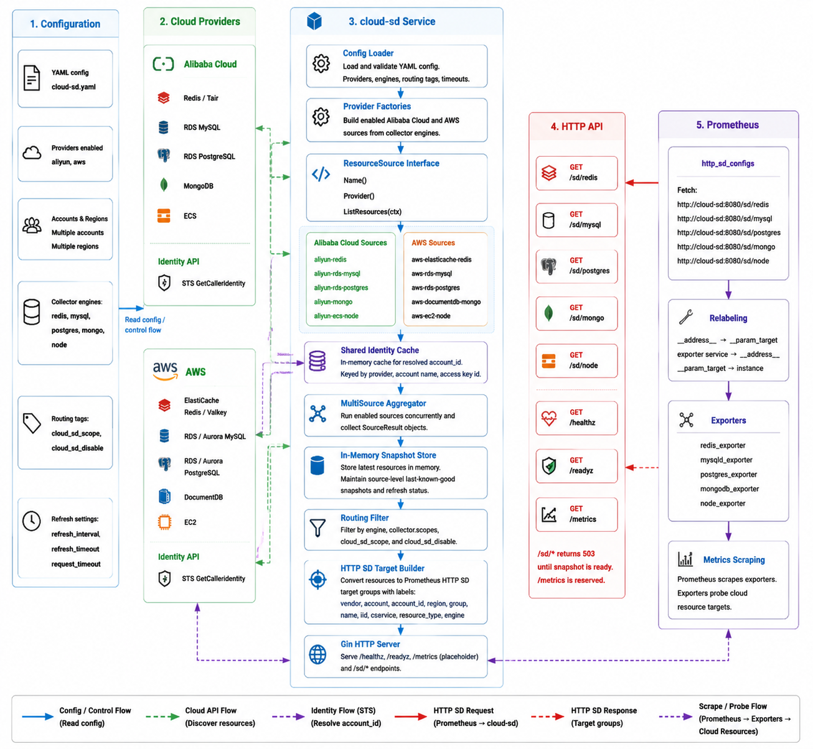

# prometheus-cloud-sd

[](go.mod)
[](docs/prometheus.md)
[](#status)

prometheus-cloud-sd is a multi-cloud resource discovery service for Prometheus HTTP Service Discovery. It discovers cloud databases, middleware, and compute resources from Alibaba Cloud and AWS, converts them into Prometheus `http_sd_configs` target groups, and lets Prometheus scrape them through exporters.

[中文文档](README.zh-CN.md) | [Prometheus integration](docs/prometheus.md) | [Kubernetes manifests](deploy/) | [Example config](examples/config.yaml)

## Status

`v0.1.1` is the current release. `v0.1.0` was the first usable release.

Included:

- Alibaba Cloud: Redis/Tair, RDS MySQL, RDS PostgreSQL, MongoDB, ECS
- AWS: ElastiCache Redis/Valkey, RDS/Aurora MySQL, RDS/Aurora PostgreSQL, DocumentDB, EC2
- Prometheus HTTP SD endpoints for Redis, MySQL, PostgreSQL, MongoDB, and Node Exporter targets
- tag/scope filtering with `cloud_sd_scope` and `cloud_sd_disable`
- Kubernetes manifests for prometheus-cloud-sd and exporters
- GHCR image publishing workflow

Still intentionally out of scope for v0.1.1:

- UI
- database storage
- HTTP auth
- persistent cache

## Quick Start

### Kubernetes

1. Publish or select an image.

The default manifest uses:

```text
ghcr.io/ylighgh/prometheus-cloud-sd:v0.1.1
```

The image is built by [.github/workflows/docker.yml](.github/workflows/docker.yml). It runs on `v*` tags and can also be triggered manually.

2. Update credentials and config.

Edit [deploy/prometheus-cloud-sd/prometheus-cloud-sd.yaml](deploy/prometheus-cloud-sd/prometheus-cloud-sd.yaml):

- replace every `CHANGE_ME`
- review enabled providers, accounts, regions, scopes, and engines
- update the image if you publish it somewhere else

3. Deploy prometheus-cloud-sd.

```bash
kubectl apply -f deploy/prometheus-cloud-sd/prometheus-cloud-sd.yaml
kubectl -n monitoring rollout status deploy/prometheus-cloud-sd
```

4. Deploy exporters if needed.

```bash
kubectl apply -f deploy/exporters/
```

Detailed deployment docs:

- [prometheus-cloud-sd Kubernetes deployment](deploy/prometheus-cloud-sd/)
- [exporter Kubernetes manifests](deploy/exporters/)
- [Prometheus scrape configs](docs/prometheus/exporters/)

### Local Run

```bash
export ALIYUN_PROD_ACCESS_KEY_ID="your-access-key-id"
export ALIYUN_PROD_ACCESS_KEY_SECRET="your-access-key-secret"
export AWS_ACCESS_KEY_ID="your-access-key-id"
export AWS_SECRET_ACCESS_KEY="your-secret-access-key"

go run ./cmd/prometheus-cloud-sd -config examples/config.yaml
```

Check the service:

```bash
curl http://localhost:8080/healthz
curl http://localhost:8080/readyz
curl http://localhost:8080/sd/redis
```

## Supported Resources

| Endpoint | Engine | Alibaba Cloud | AWS |
|---|---|---|---|
| `/sd/redis` | `redis` | Redis / Tair | ElastiCache Redis / Valkey |
| `/sd/mysql` | `mysql` | RDS MySQL | RDS MySQL / Aurora MySQL |
| `/sd/postgres` | `postgres` | RDS PostgreSQL | RDS PostgreSQL / Aurora PostgreSQL |
| `/sd/mongo` | `mongo` | MongoDB | DocumentDB |
| `/sd/node` | `node` | ECS | EC2 |

`/sd/node` does not filter by instance status. Stopped instances remain visible to Prometheus as unreachable targets so power state changes can become monitoring signals.

## Architecture



```text
Cloud APIs
   |
   v
ResourceSource adapters
   |
   v
MultiSource aggregator
   |
   v
In-memory snapshot store
   |
   v
Prometheus HTTP SD endpoints
```

Every provider adapter implements:

```go
type ResourceSource interface {
    Name() string
    Provider() core.Provider
    ListResources(ctx context.Context) ([]core.Resource, error)
}
```

Provider factories build enabled sources from YAML config. Future Huawei Cloud, CMDB, MCP, or other inventory adapters can use the same interface without changing the Prometheus-facing API.

## Configuration

prometheus-cloud-sd uses YAML. Start from [examples/config.yaml](examples/config.yaml) or the ConfigMap in [deploy/prometheus-cloud-sd/prometheus-cloud-sd.yaml](deploy/prometheus-cloud-sd/prometheus-cloud-sd.yaml).

Minimal shape:

```yaml
server:
  listen: ":8080"

collector:
  scopes: []
  engines:
    redis: true
    mysql: true
    postgres: true
    mongo: true
    node: true
  refresh_interval: 5m
  refresh_timeout: 1m
  request_timeout: 20s

routing:
  scope_tag: cloud_sd_scope
  disable_tag: cloud_sd_disable

aliyun:
  enabled: true
  accounts:
    - name: prod
      regions: [ap-southeast-1]
      access_key_id_env: ALIYUN_PROD_ACCESS_KEY_ID
      access_key_secret_env: ALIYUN_PROD_ACCESS_KEY_SECRET
```

Notes:

- Empty `collector.scopes` means discover all non-disabled resources.
- `account_id` is resolved through cloud STS APIs and cached in memory.
- Use environment variables or Kubernetes Secrets for AK/SK in production.

## HTTP API

| Endpoint | Description |
|---|---|
| `GET /sd/redis` | Redis-compatible targets |
| `GET /sd/mysql` | MySQL-compatible targets |
| `GET /sd/postgres` | PostgreSQL-compatible targets |
| `GET /sd/mongo` | MongoDB-compatible targets |
| `GET /sd/node` | Node Exporter targets |
| `GET /healthz` | Liveness check |
| `GET /readyz` | Readiness and refresh status |
| `GET /metrics` | Reserved metrics endpoint |

Example target group:

```json
[
  {
    "targets": ["redis.example.com:6379"],
    "labels": {
      "vendor": "aliyun",
      "account": "prod",
      "account_id": "123456789",
      "region": "cn-hangzhou",
      "group": "id1",
      "name": "prod-redis-cache",
      "iid": "r-bp123",
      "cservice": "redis",
      "resource_type": "redis_instance",
      "engine": "redis"
    }
  }
]
```

## Prometheus

Prometheus reads prometheus-cloud-sd through `http_sd_configs`, then relabels discovered resource addresses into exporter probe targets.

Use cloud-neutral job names:

```text
cloud-redis
cloud-mysql
cloud-postgres
cloud-mongo
cloud-node
```

Detailed examples:

- [Prometheus integration guide](docs/prometheus.md)
- [scrape config snippets](docs/prometheus/exporters/)
- [exporter Kubernetes manifests](deploy/exporters/)

## Labels

prometheus-cloud-sd emits dashboard-friendly labels:

```text
vendor, account, account_id, region, group, name, iid, cservice, resource_type, engine
```

The label set is designed for Grafana variable chains such as:

```text
vendor -> account -> group -> name -> instance
```

## Permissions

Use least-privilege read-only cloud credentials.

Alibaba Cloud needs STS identity, resource listing, resource details, and tag read permissions for Redis/Tair, RDS, MongoDB, and ECS.

AWS needs STS identity, EC2 `DescribeInstances`, ElastiCache `DescribeReplicationGroups` / `ListTagsForResource`, RDS `DescribeDBInstances`, and DocumentDB `DescribeDBClusters` / `ListTagsForResource`.

## Development

```bash
make test
make build
make run
```

The binary is written to `bin/prometheus-cloud-sd`.

## Roadmap

- Huawei Cloud adapter
- Prometheus `client_golang` metrics
- HTTP endpoint auth
- optional read-only UI
- optional disk cache for the latest successful snapshot
- finer-grained per-account and per-region last-known-good cache
- identity resolution singleflight to reduce STS calls

## License

prometheus-cloud-sd is licensed under the [Apache License 2.0](LICENSE).
