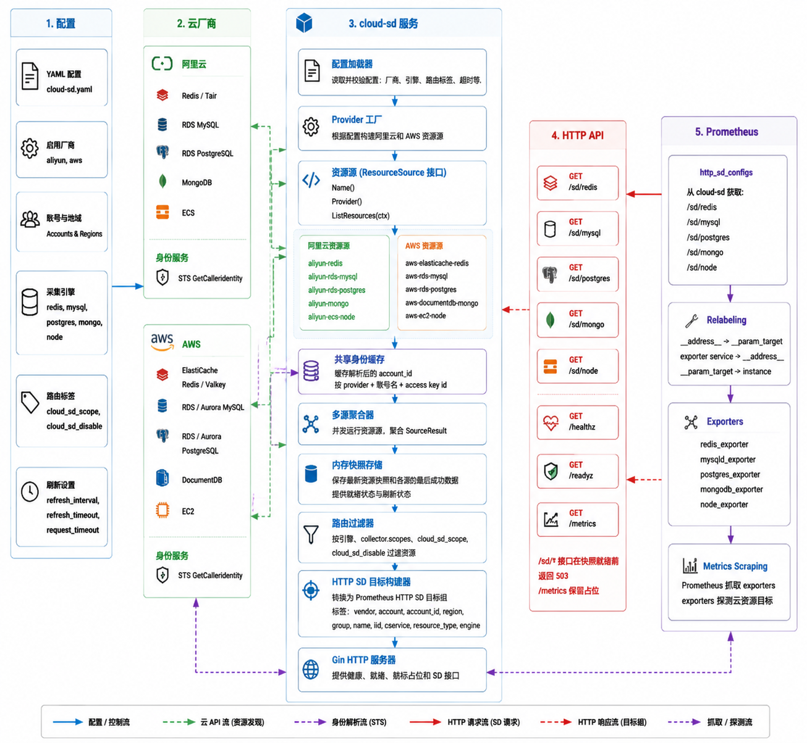

# prometheus-cloud-sd

[](go.mod)
[](docs/prometheus.zh-CN.md)
[](#项目状态)

prometheus-cloud-sd，也就是 cloud-sd，是一个面向 Prometheus HTTP Service Discovery 的多云资源发现服务。它从 Alibaba Cloud 和 AWS 发现云数据库、中间件和计算资源，转换为 Prometheus `http_sd_configs` 兼容的 target groups，让 Prometheus 可以配合 exporter 采集。

[English](README.md) | [Prometheus 集成](docs/prometheus.zh-CN.md) | [Kubernetes 清单](deploy/) | [示例配置](examples/config.yaml)

## 项目状态

`v0.1.0` 是第一个可用版本。

已包含：

- Alibaba Cloud：Redis/Tair、RDS MySQL、RDS PostgreSQL、MongoDB、ECS
- AWS：ElastiCache Redis/Valkey、RDS/Aurora MySQL、RDS/Aurora PostgreSQL、DocumentDB、EC2
- Redis、MySQL、PostgreSQL、MongoDB 和 Node Exporter 的 Prometheus HTTP SD endpoints
- 基于 `cloud_sd_scope` 和 `cloud_sd_disable` 的 tag/scope 过滤
- cloud-sd 和 exporters 的 Kubernetes 清单
- GHCR 镜像发布 workflow

`v0.1.0` 仍然刻意保持运行时轻量：

- 不做 UI
- 不依赖数据库
- 暂无 HTTP auth
- 暂无持久化缓存

## 快速开始

### Kubernetes

1. 发布或选择镜像。

默认清单使用：

```text
ghcr.io/ylighgh/prometheus-cloud-sd:v0.1.0
```

镜像由 [.github/workflows/docker.yml](.github/workflows/docker.yml) 构建。推送 `v*` tag 会自动触发，也可以手动运行 workflow。

2. 更新凭证和配置。

编辑 [deploy/cloud-sd/cloud-sd.yaml](deploy/cloud-sd/cloud-sd.yaml)：

- 替换所有 `CHANGE_ME`
- 检查启用的云厂商、账号、地域、scopes 和 engines
- 如果镜像发布到其他仓库，需要改掉默认 image

3. 部署 cloud-sd。

```bash
kubectl apply -f deploy/cloud-sd/cloud-sd.yaml
kubectl -n monitoring rollout status deploy/cloud-sd
```

4. 按需部署 exporters。

```bash
kubectl apply -f deploy/exporters/
```

详细文档：

- [cloud-sd Kubernetes 部署](deploy/cloud-sd/)
- [exporter Kubernetes 清单](deploy/exporters/)
- [Prometheus scrape 配置](docs/prometheus/exporters/)

### 本地运行

```bash
export ALIYUN_PROD_ACCESS_KEY_ID="your-access-key-id"
export ALIYUN_PROD_ACCESS_KEY_SECRET="your-access-key-secret"
export AWS_ACCESS_KEY_ID="your-access-key-id"
export AWS_SECRET_ACCESS_KEY="your-secret-access-key"

go run ./cmd/cloud-sd -config examples/config.yaml
```

验证接口：

```bash
curl http://localhost:8080/healthz
curl http://localhost:8080/readyz
curl http://localhost:8080/sd/redis
```

## 支持的资源

| Endpoint | Engine | Alibaba Cloud | AWS |
|---|---|---|---|
| `/sd/redis` | `redis` | Redis / Tair | ElastiCache Redis / Valkey |
| `/sd/mysql` | `mysql` | RDS MySQL | RDS MySQL / Aurora MySQL |
| `/sd/postgres` | `postgres` | RDS PostgreSQL | RDS PostgreSQL / Aurora PostgreSQL |
| `/sd/mongo` | `mongo` | MongoDB | DocumentDB |
| `/sd/node` | `node` | ECS | EC2 |

`/sd/node` 不按实例状态过滤。停止或误关机实例仍会暴露给 Prometheus，并表现为不可达 target，这样电源状态变化也能成为监控信号。

## 架构



```text
Cloud APIs
   |
   v
ResourceSource adapters
   |
   v
MultiSource aggregator
   |
   v
In-memory snapshot store
   |
   v
Prometheus HTTP SD endpoints
```

每个 provider adapter 实现同一个接口：

```go
type ResourceSource interface {
    Name() string
    Provider() core.Provider
    ListResources(ctx context.Context) ([]core.Resource, error)
}
```

Provider factory 根据 YAML 配置构建启用的 sources。后续 Huawei Cloud、CMDB、MCP 或其他 inventory adapters 可以复用同一套接口，不需要改变 Prometheus-facing API。

## 配置

cloud-sd 使用 YAML。可以从 [examples/config.yaml](examples/config.yaml) 或 [deploy/cloud-sd/cloud-sd.yaml](deploy/cloud-sd/cloud-sd.yaml) 里的 ConfigMap 开始。

最小结构：

```yaml
server:
  listen: ":8080"

collector:
  scopes: []
  engines:
    redis: true
    mysql: true
    postgres: true
    mongo: true
    node: true
  refresh_interval: 5m
  refresh_timeout: 1m
  request_timeout: 20s

routing:
  scope_tag: cloud_sd_scope
  disable_tag: cloud_sd_disable

aliyun:
  enabled: true
  accounts:
    - name: prod
      regions: [ap-southeast-1]
      access_key_id_env: ALIYUN_PROD_ACCESS_KEY_ID
      access_key_secret_env: ALIYUN_PROD_ACCESS_KEY_SECRET
```

说明：

- `collector.scopes` 为空表示发现所有未禁用资源。
- `account_id` 会通过云厂商 STS API 自动解析，并缓存在内存中。
- 生产环境建议通过环境变量或 Kubernetes Secret 注入 AK/SK。

## HTTP API

| Endpoint | 说明 |
|---|---|
| `GET /sd/redis` | Redis-compatible targets |
| `GET /sd/mysql` | MySQL-compatible targets |
| `GET /sd/postgres` | PostgreSQL-compatible targets |
| `GET /sd/mongo` | MongoDB-compatible targets |
| `GET /sd/node` | Node Exporter targets |
| `GET /healthz` | 存活检查 |
| `GET /readyz` | 就绪状态和刷新状态 |
| `GET /metrics` | 预留 metrics endpoint |

HTTP SD 返回示例：

```json
[
  {
    "targets": ["redis.example.com:6379"],
    "labels": {
      "vendor": "aliyun",
      "account": "prod",
      "account_id": "123456789",
      "region": "cn-hangzhou",
      "group": "id1",
      "name": "prod-redis-cache",
      "iid": "r-bp123",
      "cservice": "redis",
      "resource_type": "redis_instance",
      "engine": "redis"
    }
  }
]
```

## Prometheus

Prometheus 通过 `http_sd_configs` 读取 cloud-sd，再用 relabel 把发现到的资源地址转成 exporter probe target。

推荐使用云厂商无关的 job 名：

```text
cloud-redis
cloud-mysql
cloud-postgres
cloud-mongo
cloud-node
```

详细示例：

- [Prometheus 集成指南](docs/prometheus.zh-CN.md)
- [scrape config snippets](docs/prometheus/exporters/)
- [exporter Kubernetes 清单](deploy/exporters/)

## Labels

cloud-sd 输出面向看板友好的 labels：

```text
vendor, account, account_id, region, group, name, iid, cservice, resource_type, engine
```

这组 labels 适合 Grafana 变量链：

```text
vendor -> account -> group -> name -> instance
```

## 权限

建议使用最小权限只读云凭证。

Alibaba Cloud 需要 Redis/Tair、RDS、MongoDB、ECS 的 STS 身份、资源列表、资源详情和 tag 读取权限。

AWS 需要 STS 身份、EC2 `DescribeInstances`、ElastiCache `DescribeReplicationGroups` / `ListTagsForResource`、RDS `DescribeDBInstances`、DocumentDB `DescribeDBClusters` / `ListTagsForResource`。

## 开发

```bash
make test
make build
make run
```

构建产物会写入 `bin/cloud-sd`。

## Roadmap

- Huawei Cloud adapter
- Prometheus `client_golang` metrics
- HTTP endpoint auth
- optional read-only UI
- optional disk cache for the latest successful snapshot
- 更细粒度的 account / region last-known-good cache
- identity resolution singleflight，减少 STS 调用

## License

cloud-sd 使用 [Apache License 2.0](LICENSE) 开源许可。
